# Windows Server 2022 Active Directory Lab
A virtualized lab demonstrating deployment of Windows Server 2022 as a domain controller, DNS/DHCP configuration, and Windows 11 client domain integration for enterprise simulation.

- Windows Server 2022 (Domain Controller, DNS, DHCP)
- Windows 11 Pro (Clients)
- VirtualBox (Virtualization)
- Active Directory, DHCP, DNS, Reverse Lookup Zones

Installed Windows Server 2022 in VirtualBox
    
    -  Named the VM
      
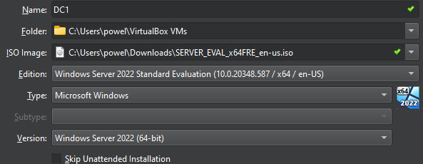

    - Allocated 4GB Ram and 2 Processors
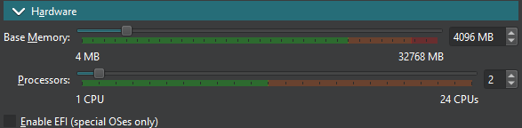

    - Allocated 50 GB of hard disk space
      
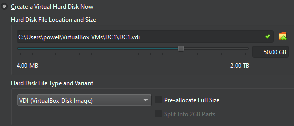

    - Created a new network for the server and client machines to connect to

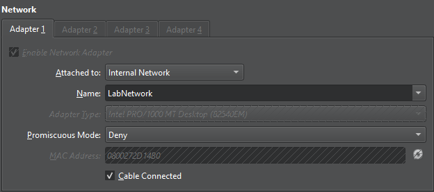

    - Manually set static IP of server to 10.0.0.4 and DNS IP addresses to Google's DNS servers
    
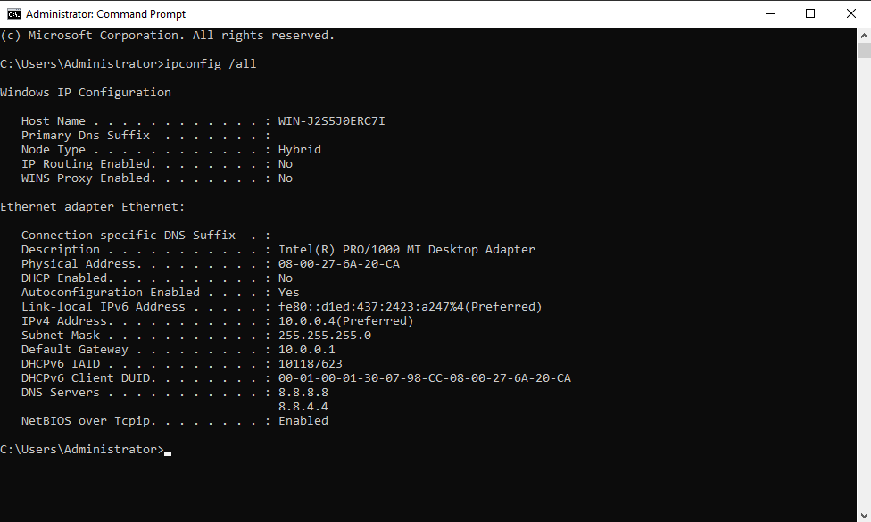

    - Installed Active Directory, DHCP, and DNS roles via the server manager

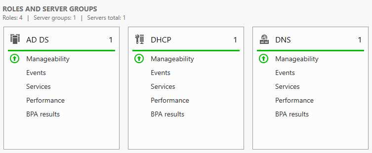

    - Configured DNS manager with Forward and Reverse Lookup Zones with A records for lab.com

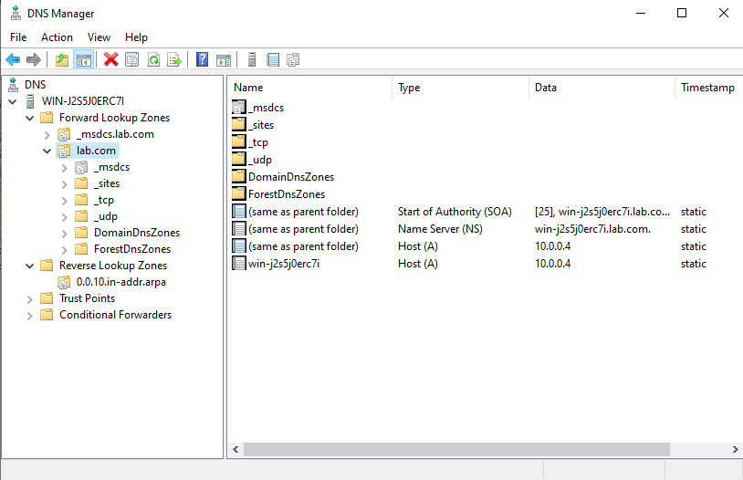

    - Configured a new scope for the DHCP role, with an IP range of 10.0.0.100 - 10.0.0.200

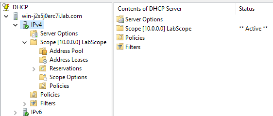

    - Created two users to test with the two client PC's I created later
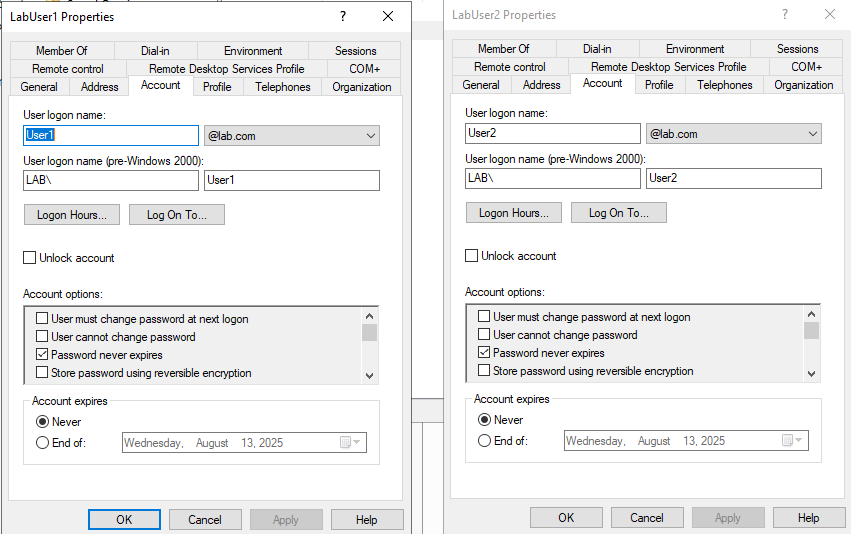

    - Here is the CMD showing everything running properly
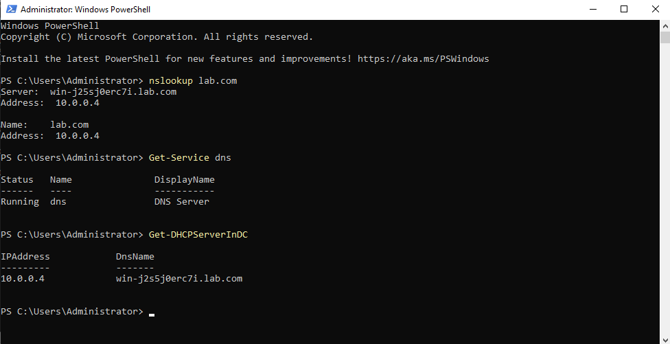

    - Created to virtual machines named Client-1 and Client-2
    
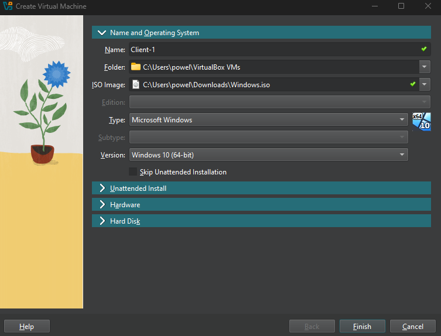

    - Client 1 and 2 screenshots of getting IP addresses from the DHCP server on the same virtual network

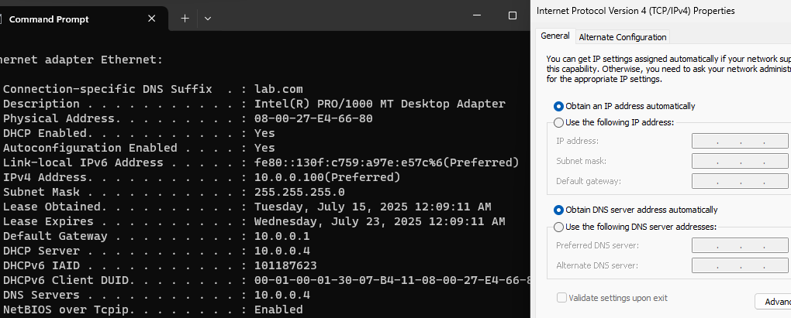 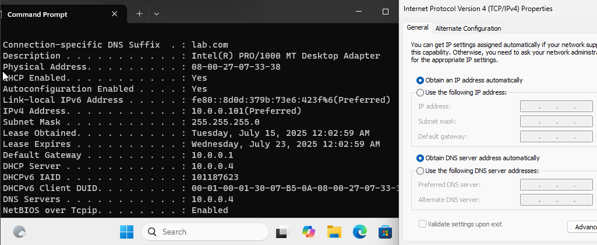

    - Ping and nslookup results for client 1 and 2
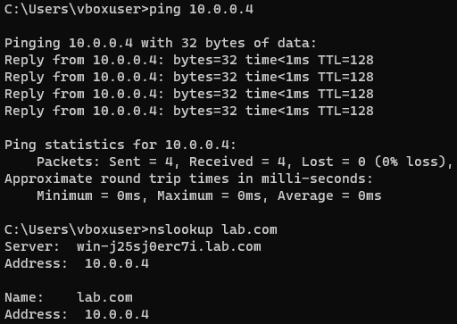 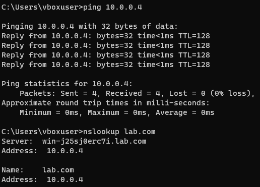

    - Client 1 and 2 successful joining of the lab.com domain
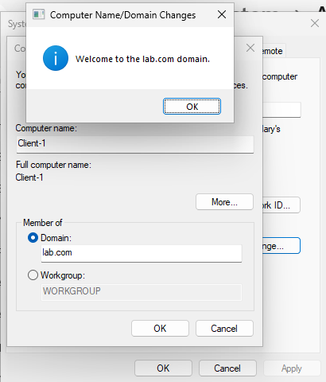 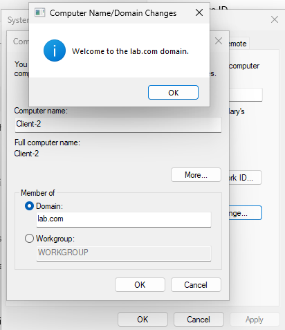

    - Client 1 and 2 successful signing in after being joined to the lab.com domain

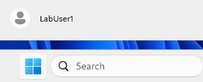 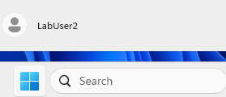
